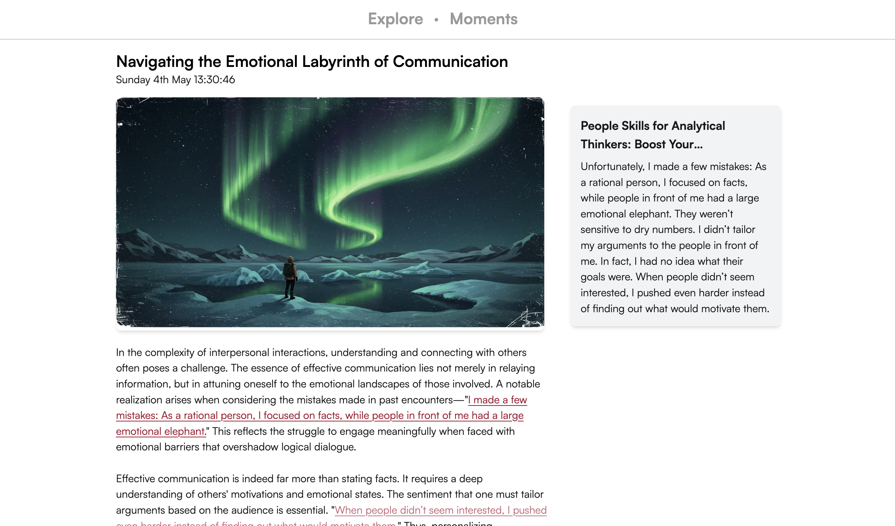
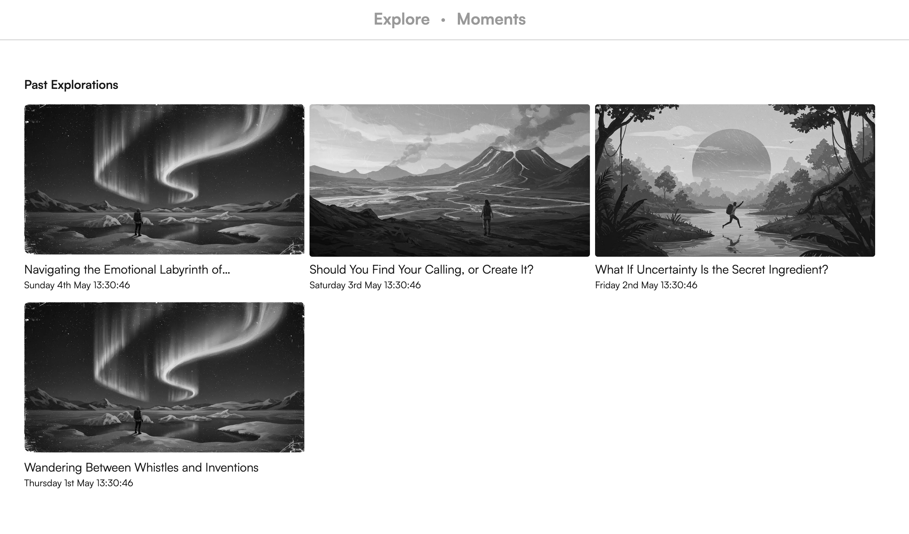
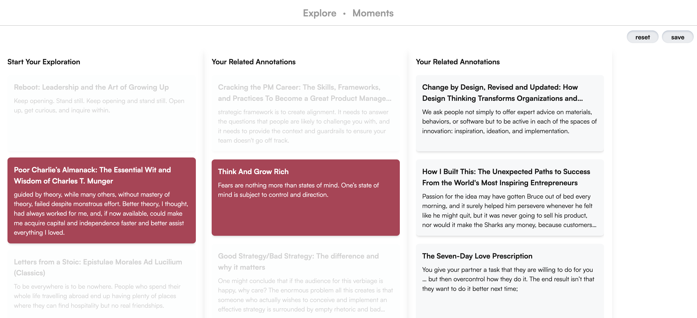

# Reading Trails

Over 10 years, I've accumulated a heap of annotations from the books I've read. I put this application together to produce a moment of curiosity in my day by generating a thematic post derived from all these annotations. An demo version of this can be seen at https://trails-production.up.railway.app/moments.

Every day, the application will select a set of annotations and pass those to an LLM to generate a post based on a common theme or set of themes discussed in the annotations. The subset of annotations are selected randomly and others are added based on how often they have previously been used. The latter ensures that less commonly seen annotations are not forgotten.

The frontend displays all generated entries in the Moments tab in a grid display.

Each individual entry contains the post plus a set of references which can be clicked to showcase the original annotation these are based on.

## Trails
On the `Explore` tab there is some functionality built to explore annotations in a sequential way. A subset of annotations is shown and by clicking on one, another subset is revealed. 

*Note: There is not logic yet though to relate each subsequent layer*

## How to run
The annotations were downloaded from Readwise, however, there is functionality to process the Kindle's My Clippings file. The results are not as clean as the Readwise export however. The script for processing the Readwise CSV is located at `./backend/scripts/import_readwise.py`.

For simplicity sake, JSON files were used to act as a database.

### Frontend
`npm run dev` or build and run with `npm run build` and then `npm run start`.

### Backend
The backend is Python based and uses `uv` to manage the project. Use `uv init` to synchronise the local repo and then `uv run fastapi dev src/app.py` from the backend root.